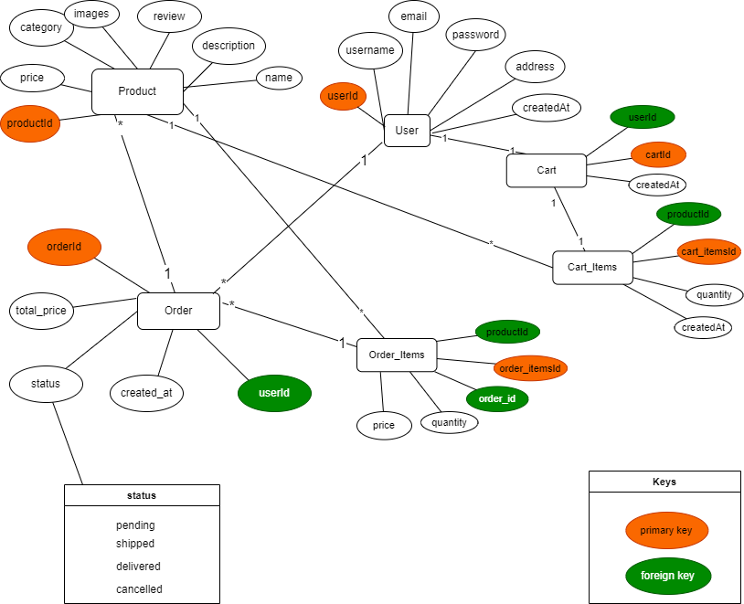

# Full-Stack E-Commerce Website

This is a **full-stack e-commerce website** built using three different backend technologies: **Flask**, **Spring Boot**, and **ExpressJS**, and a modern frontend using **ReactJS** with **ViteJS**. The project demonstrates how a multi-backend architecture can power an e-commerce platform, allowing you to explore and compare these technologies.

## Table of Contents


- [Technologies Used](#technologies-used)
- [Features](#features)
- [Database Design](#database-design)
- [Getting Started](#getting-started)
- [Frontend Setup](#frontend-setup)
- [Backend Setup Flask](#backend-setup-flask)
- [Backend Setup Spring Boot](#backend-setup-spring-boot)
- [Backend Setup ExpressJS](#backend-setup-expressjs)
- [Database Configuration](#database-configuration)
- [Docker Configuration (Optional)](#docker-configuration)


## Technologies Used

### Frontend:
- **ReactJS**: A JavaScript library for building user interfaces.
- **ViteJS**: A fast build tool that enhances the development experience with rapid Hot Module Replacement (HMR).
- **TailwindCSS**: For styling and layout.

### Backend:
- **Flask (Python)**: A lightweight Python web framework for building REST APIs.
- **Spring Boot (Java)**: A Java-based framework for creating stand-alone, production-grade Spring-based applications.
- **ExpressJS (Node.js)**: A minimal and flexible Node.js web application framework for building APIs.

### Database:
- **MySQL**  to store product and user data.

### Other Tools:
- **Docker**: For containerizing the applications.
- **JWT**: For secure user authentication.

## Features

- **User Authentication**: Users can register, log in, and manage their profiles securely.
- **Product Management**: Admins can add, edit, and delete products from the store.
- **Shopping Cart**: Users can add products to their cart and proceed to checkout.
- **Order Management**: Admins can manage customer orders and their statuses.
- **Responsive Design**: The website is fully responsive and works seamlessly on both mobile and desktop devices.

## Database Design

This project utilizes a **MySQL** database to store all essential data, including product information, user details, and order records. 

The database schema is designed to support robust e-commerce functionality, ensuring efficient querying, normalization, and relational integrity.


#### Database Design Overview

The following diagram provides a visual representation of the database schema used in this project:



## Getting Started

### Prerequisites

Ensure you have the following software installed:

- **Node.js** (for the frontend)
- **Python** (for Flask backend)
- **Java JDK** (for Spring Boot backend)
- **Node.js** (for ExpressJS backend)
- **MySQL** (or your preferred database)
- **Docker** (optional, for containerization)

### Clone the Repository

Clone the repository to your local machine:

```bash
git clone https://github.com/imadjaha/e-commerce.git
cd e-commerce
```

## Frontend Setup

1. Navigate to the frontend directory:

    ```bash
    cd frontend
    ```

2. Install dependencies:

    ```bash
    npm install
    ```

3. Start the development server:

    ```bash
    npm run dev
    ```
    this frontend will be available at http://localhost:5173 (default port)

## Backend Setup Flask

1. Navigate to the Flask backend directory:

    ```bash
    cd flask-backend
    ```

2. Install dependencies:

    ```bash
    pip install -r requirements.txt
    ```

3. Run the Flask backend:

    ```bash
    python app.py
    ```
    this backend will be available at http://localhost:5000 (default port)

## Backend Setup Spring Boot

1. Navigate to the Spring Boot backend directory:

    ```bash
    cd spring-boot-backend
    ```  

2. Run the Spring Boot backend:

    ```bash
    mvn spring-boot:run
    ```
    this backend will be available at http://localhost:8080 (default port)

## Backend Setup ExpressJS

1. Navigate to the ExpressJS backend directory:

    ```bash
    cd express-backend
    ```

2. Install dependencies:

    ```bash
    npm install
    ```

3. Run the ExpressJS backend:

    ```bash
    nodemon server.js
    ```
    this backend will be available at http://localhost:3000 (default port)
    

## Database Configuration

1. Set up your database: Ensure that the MySQL (or the chosen database) server is running, and you have created the necessary database schema. Refer to the respective backend README files for specific database setup and schema instructions.

2.  Configure database connection: Modify the database connection strings in each backend service to match your local database configuration.


## Docker Configuration (Optional)

1. Set up your database (e.g., MySQL or PostgreSQL) and create the necessary schemas.

2. Update the database connection details in the respective backend services (Flask, Spring Boot, and ExpressJS).

3. For local development, you can use Docker to containerize the database service as well.

Running with Docker (Optional)
To run the entire application with Docker (frontend and backend), make sure Docker is installed on your machine and run the following command:

```bash
docker compose up --build
```
this will start all the backend services (Flask, Spring Boot and ExpressJS) and the frontend in a single container.